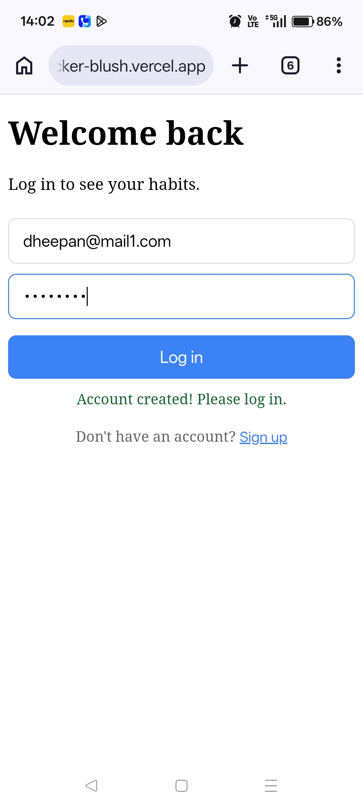
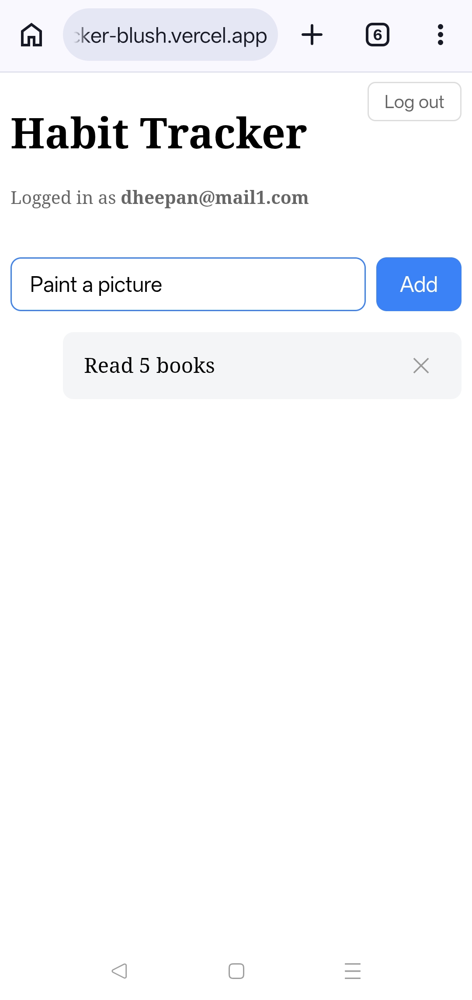
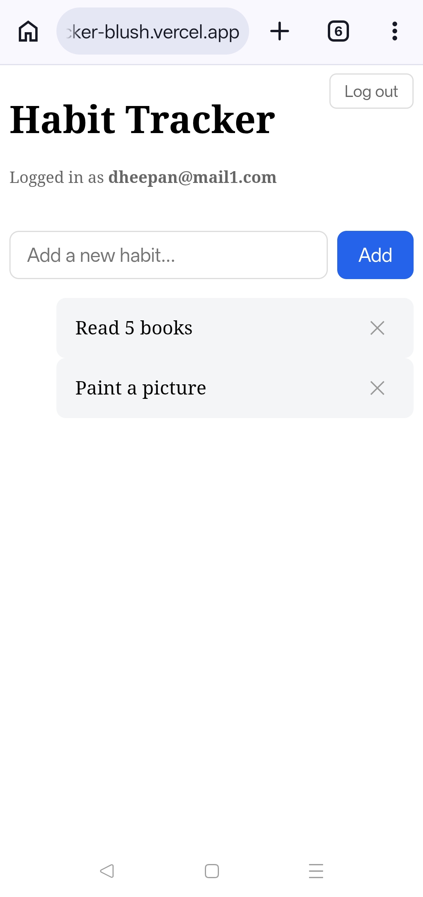
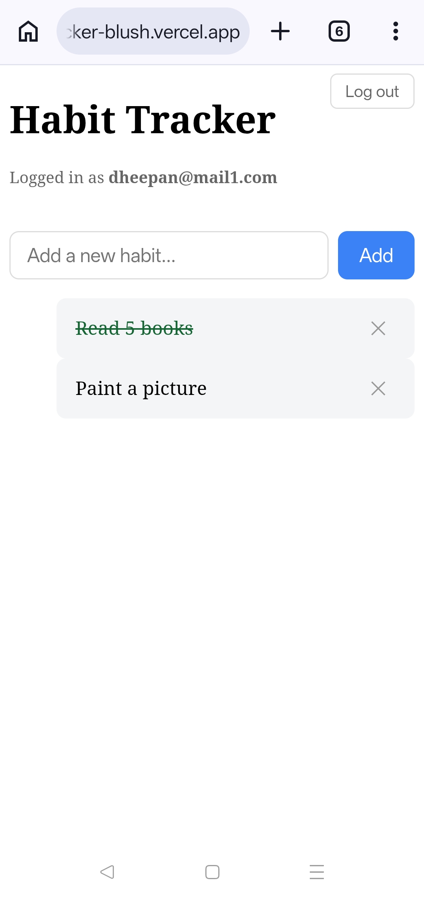
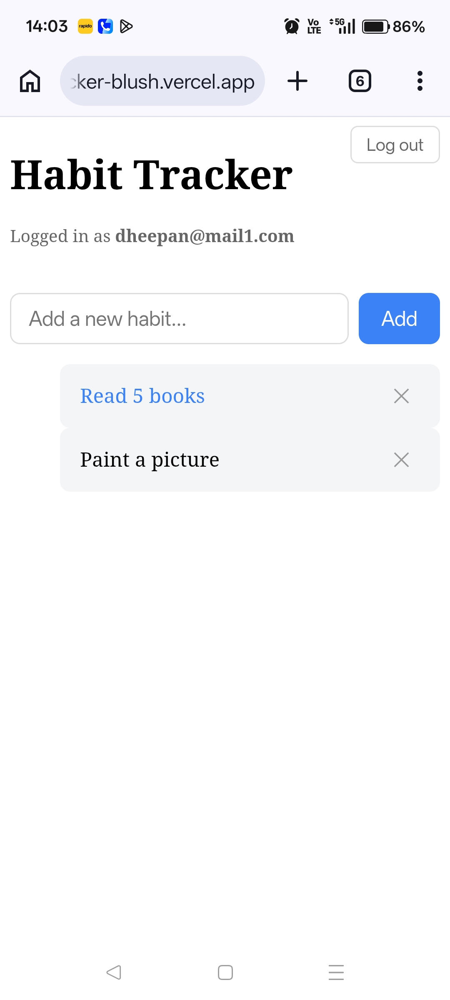

# Habit Tracker

A fullstack habit tracker with user authentication.

## Live
- **Frontend:** https://fullstack-habit-tracker-blush.vercel.app
- **Backend API:** https://habit-tracker-api-h8e8.onrender.com

## Stack
- **Frontend:** React (Vite)
- **Backend:** Node.js + Express
- **Database:** SQLite (better-sqlite3)
- **Auth:** JWT + bcrypt

## Features
- User signup and login
- Create, toggle, and delete habits
- Per-user data isolation (each user sees only their own habits)
- Persistent sessions via JWT stored in localStorage

## Local Development

### Backend
\`\`\`bash
cd server
npm install
echo "JWT_SECRET=$(node -e "console.log(require('crypto').randomBytes(48).toString('hex'))")" > .env
echo "JWT_EXPIRES_IN=7d" >> .env
npm run dev
\`\`\`

### Frontend
\`\`\`bash
cd client
npm install
npm run dev
\`\`\`

Frontend runs on http://localhost:5173, backend on http://localhost:3000.

## API Endpoints

| Method | Path | Auth | Purpose |
|--------|------|------|---------|
| POST | /api/auth/signup | No | Create a user |
| POST | /api/auth/login | No | Log in, get a JWT |
| GET | /api/habits | Yes | List this user's habits |
| POST | /api/habits | Yes | Create a habit |
| PUT | /api/habits/:id | Yes | Toggle done status |
| DELETE | /api/habits/:id | Yes | Delete a habit |

## Images

